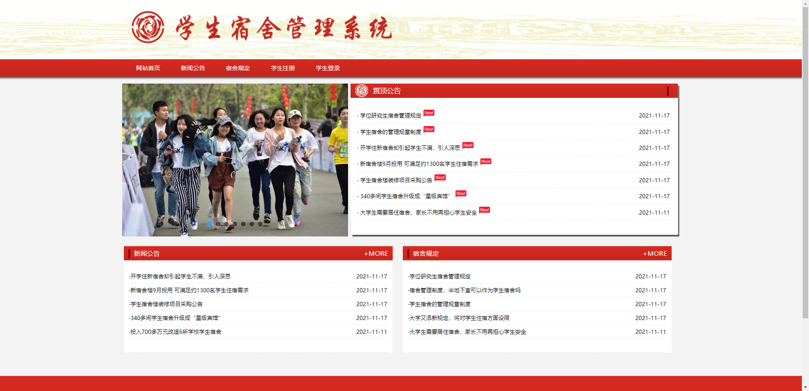
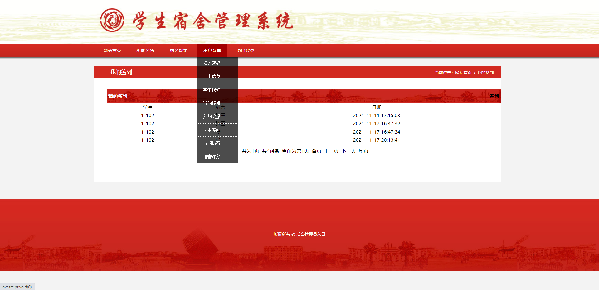
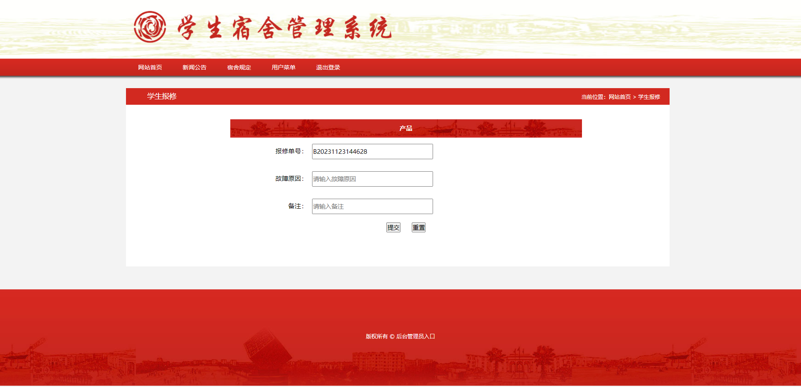
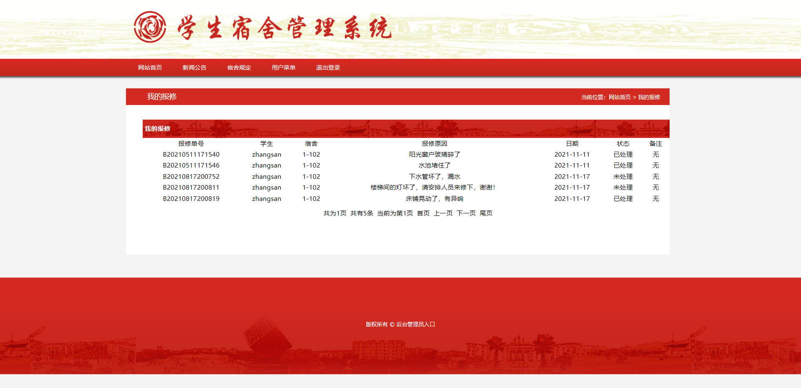
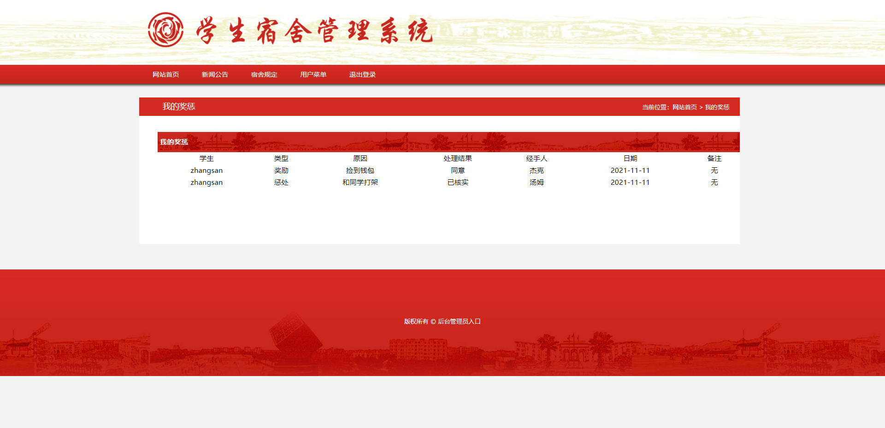
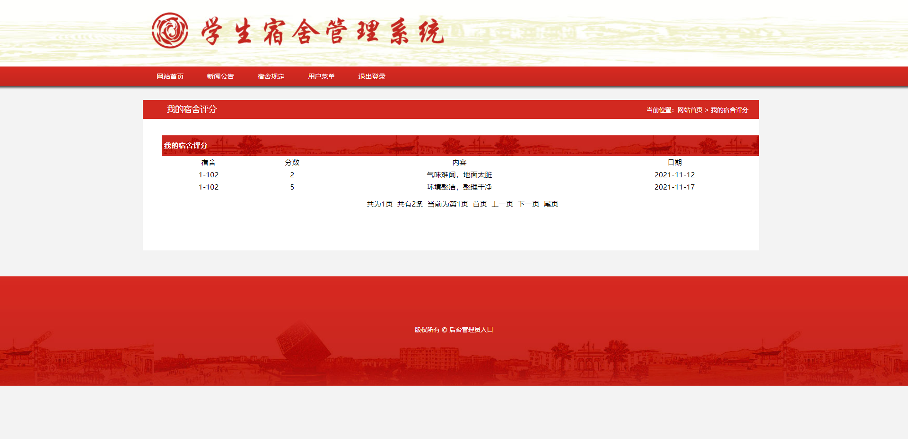
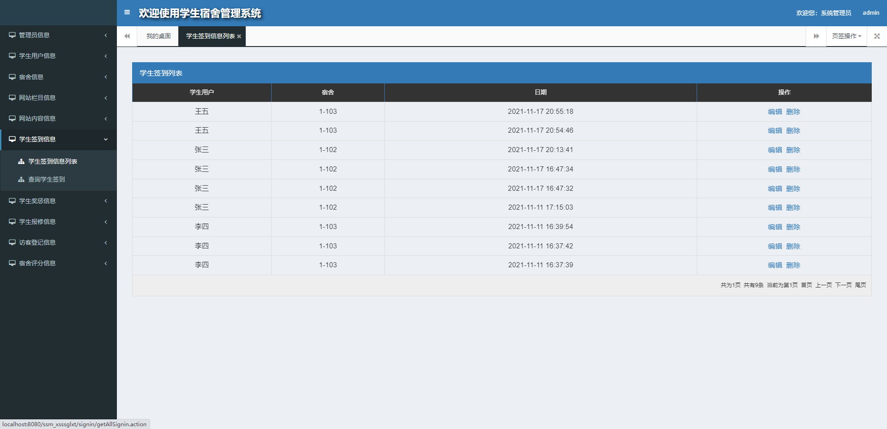
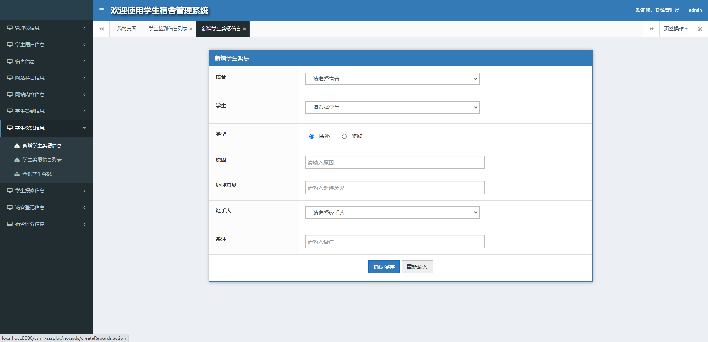
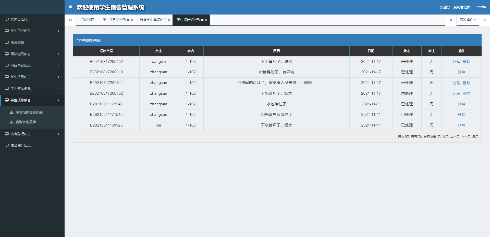
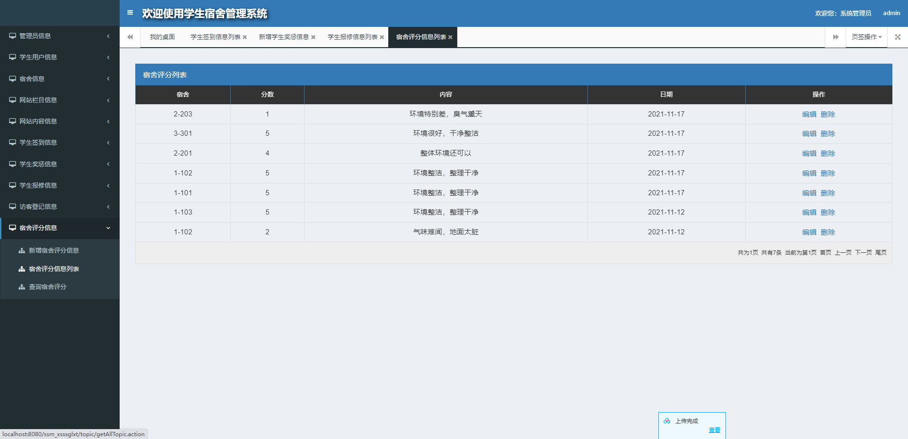

## 基于SSM框架实现的学生宿舍管理系统

- <b>完整代码获取地址：从戎源码网 ([https://armycodes.com/](https://armycodes.com/))</b>
- <b>技术探讨、资料分享，请加QQ群：692619798</b> 
- <b>作者微信：19941326836  QQ：952045282</b> 
- <b>承接计算机毕业设计、Java毕业设计、Python毕业设计、深度学习、机器学习</b>
- <b>选题+开题报告+任务书+程序定制+安装调试+论文+答辩ppt 一条龙服务</b>
- <b>所有选题地址 ([https://github.com/YuLin-Coder/AllProjectCatalog](https://github.com/YuLin-Coder/AllProjectCatalog)) </b>

## 项目介绍
基于SSM框架实现的学生宿舍管理系统，包含两种角色：管理员、用户,系统分为前台和后台两大模块，主要功能如下。
1.【前台功能】
首页、新闻公告、宿舍规定、学生注册、学生登陆、个人中心、学生信息、学生报修、我的报修、我的奖惩、学生签到、我的访客、宿舍评分、修改密码等功能。

2.【后台功能】
学生信息管理、管理员管理、宿舍管理、网站公告管理、学生签到管理、学生奖惩管理、学生报修管理、访客登记管理、宿舍评分管理等功能。

## 项目技术
- 编程语言：Java
- 数据库：MySQL
- 前端技术：JSP、Jquery、Bootstrap、Layui
- 后端技术：Spring、SpringMVC、MyBatis

## 运行环境
- JDK版本：JDK1.8及以上
- 开发工具：IDEA、Ecplise、Myecplise都可以
- 数据库: MySQL5.7及以上

## 运行截图

